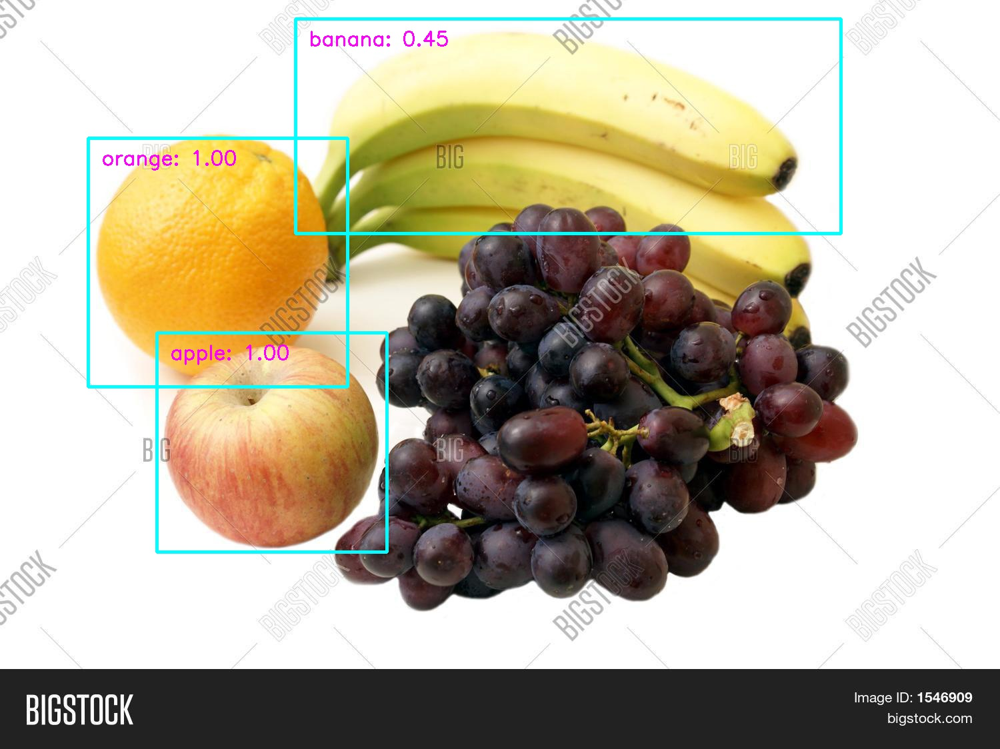

# Object-Detection
Object Detection Fine tune

This project is to use Pytorch official MobilenetV3-Large-SSD-list model to finetune fruit dataset
This model pretrained in COCO dataset

Here is the paper for MobilenetV3:
[MobilenetV3](https://arxiv.org/abs/1905.02244)
[SSD](https://arxiv.org/pdf/1512.02325.pdf)

Usage:
create conda enviroment by enviroment.yml
```
conda env create -f environment.yml
conda activate Pytorch
```

Run the main.py
```
python main.py

```

Run the test
```
python test.py

```

Here is the result produce by the test.py



   